# Introduzione
L'Ontology Designer è uno strumento che consente di creare e modificare graficamente un'ontologia.

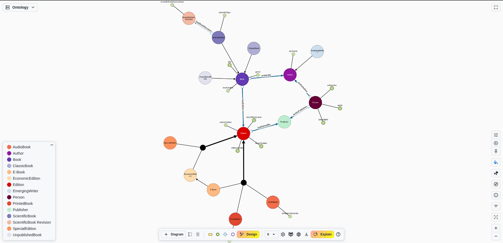

In questo ambiente è possibile sia [creare una nuova ontologia](#creazione-di-una-nuova-ontologia) che [modificare](#modifica-di-un-ontologia) un'ontologia esistente.

# Creazione o modifica di una ontologia
Per iniziare a usare l'ontology designer si può creare una nuova ontologia vuota o modificarne una esistente anche partendo da un file OWL.

Per creare una nuova ontologia, è necessario scegliere l'IRI e la versione. Questi possono anche essere modificati successivamente nel [impostazioni](#gestore-ontologia).
Alternativamente è possibile importare un'ontologia esistente e proseguire nella relativa modifica.
Per ulteriori informazioni sull'importazione di un'ontologia, si rimanda alla sezione delle impostazioni, dove il processo è identico: [Importa Ontologia](#importa-ontologia).

# Barra degli strumenti principale

Attraverso la **Barra degli strumenti** è possibile aggiungere qualsiasi tipo di nuovo elemento all'ontologia, dai diagrammi ai nodi e agli archi ai metadati dell'ontologia, nonché salvare lo stato corrente.

In dettaglio, i comandi disponibili sono:

  - **Add Diagram**, mediante il quale è possibile aggiungere un nuovo diagramma;
  - **Rename Diagram**, mediante il quale è possibile rinominare il diagramma corrente;
  - **Delete Diagram**, mediante il quale è possibile eliminare il diagramma corrente con tutti i relativi elementi;
  - [**Add Class Node**](#aggiungi-nodo-classe), mediante il quale è possibile aggiungere uno o più nuovi nodi classe;
  - [**Add Data Property Node**](#aggiungi-nodo-data-property), mediante il quale è possibile aggiungere uno o più nuovi nodi data property;
  - [**Add Object Property Edge**](#aggiungi-arco-object-property), abilitato esclusivamente quando un nodo classe è selezionato, mediante il quale è possibile aggiungere un nuovo arco object property;
  - [**Add Individual Node**](#aggiungi-nodo-individuo), mediante il quale è possibile aggiungere uno o più nuovi nodi individuo;
  - [**AI Design**](#design-ia), mediante il quale è possibile inviare richieste all'Assistente AI per costruire frammenti dell'ontologia
  - **Language Selection**: mediante il quale è possibile selezionare la lingua delle etichette visualizzate sulle entità dell'ontologia, ove presenti. Nel caso in cui nessuna etichetta nella lingua selezionata sia disponibile, verrà visualizzata qualsiasi altra etichetta. Tale lingua viene inoltre utilizzata come predefinita per le etichette generate per le nuove entità.
  - [**Ontology Settings**](#impostazioni), che fornisce accesso alle impostazioni dell'ontologia;
  - **Preview OWL**  per aprire un drawer che visualizza la traduzione OWL dell'ontologia corrente;
  - [**Entity Catalog**](#catalogo-entità) per importare entità da un SPARQL Endpoint specificato;
  - **Download**, per salvare lo stato corrente dell'ontologia;
  - [**AI Explain**](#ai-explain) per sottoporre domande all'Assistente AI riguardanti l'ontologia corrente, al fine di chiarire aspetti logici o spiegare il significato di determinati assiomi.
  - **Help** per visualizzare il presente manuale d'uso

  
  
  
  
  
  
  
  
  
  
  

Insieme alla barra degli strumenti, ogni elemento visualizzato nei diagrammi è dotato di un **Menu Contestuale** accessibile mediante clic destro sull'elemento stesso.
I comandi disponibili in un menu contestuale di un nodo (o arco) variano in funzione del tipo di elemento al quale il menu appartiene. Il menu più elementare è quello che fornisce esclusivamente il comando *Remove*. Nelle sezioni seguenti verranno illustrati i menu contestuali più significativi.

## Menu Contestuale Nodo Classe
Il menu contestuale più completo è quello relativo ai nodi classe.

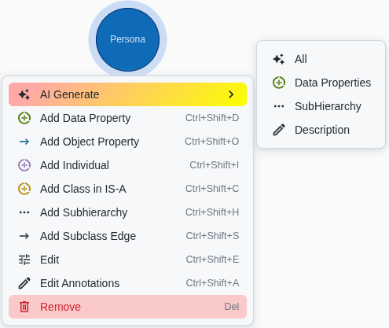

I comandi disponibili sono:

  - [**AI Generate**](#generazione-menu-contestuale), per accedere all'AI generativa e creare
    - **Data Properties**
    - **Subhierarchy**
    - **Class Description** (annotazione rdfs:comment)
  - [**Add Data Property**](#aggiungi-nodo-data-property), mediante il quale è possibile aggiungere nuovi nodi data property, le quali avranno la classe corrente come dominio;
  - [**Add Object Property**](#aggiungi-arco-object-property), mediante il quale è possibile disegnare un nuovo arco object property, il quale avrà la classe corrente come dominio;
  - [**Add Individual**](#aggiungi-nodo-individuo), mediante il quale è possibile aggiungere nuovi nodi individuo, che saranno istanze della classe corrente;
  - [**Add Class in IS-A**](#aggiungi-classe-in-is-a), mediante il quale è possibile aggiungere un nuovo nodo classe in IS-A con la classe corrente;
  - [**Add Subhierarchy**](#aggiungi-sottogerarchia), mediante il quale è possibile aggiungere un nuovo insieme di nodi classe che formeranno una sottogerarchia della classe corrente;
  - **Add Subclass Edge** mediante il quale è possibile disegnare un nuovo arco sottoclasse;
  - [**Edit**], mediante il quale è possibile rinominare o effettuare il refactoring dell'entità e modificarne le proprietà. Nel caso di refactoring, tutti i nodi dell'entità verranno modificati. È inoltre possibile selezionare se aggiornare o meno l'etichetta;
  - [**Edit Annotations**](#modifica-annotazioni), mediante il quale è possibile aggiungere, modificare o rimuovere le annotazioni della classe;
  - **Remove** mediante il quale è possibile eliminare il singolo elemento o tutti i nodi dell'entità. Qualora si scelga di rimuovere tutte le occorrenze, l'entità stessa verrà eliminata.

## Menu Contestuale Nodo Data Property

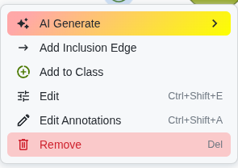

Per quanto riguarda le data property, le azioni disponibili sono:

  - **AI Generate** per le data property consente esclusivamente di ottenere una possibile descrizione della data property selezionata.
  - **Add Inclusion Edge**, mediante il quale è possibile disegnare un nuovo arco sub data property;
  - **Add to Class**, mediante il quale è possibile disegnare un nuovo arco data property alla classe dominio;
  - [**Edit**](#modifica), mediante il quale è possibile rinominare o effettuare il refactoring dell'entità e modificarne le proprietà. Nel caso di refactoring, tutti i nodi dell'entità verranno modificati. È inoltre possibile selezionare se aggiornare o meno l'etichetta;
  - [**Edit Annotations**](#modifica-annotazioni), mediante il quale è possibile aggiungere, modificare o rimuovere le annotazioni della data property;
  - **Remove**, mediante il quale è possibile eliminare il singolo elemento o tutti i nodi dell'entità. Qualora si scelga di rimuovere tutte le occorrenze, l'entità stessa verrà eliminata.

È inoltre possibile attivare/disattivare la funzionalità della data property effettuando un doppio clic sul nodo.

## Menu Contestuale Nodo Individuo

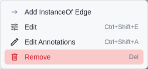

I comandi disponibili sui nodi individuo sono:

  - **Add Instance Edge**, mediante il quale è possibile disegnare un nuovo arco istanza che collega l'individuo alla relativa classe genitore;
  - [**Edit**](#modifica), mediante il quale è possibile rinominare o effettuare il refactoring dell'entità. Nel caso di refactoring, tutti i nodi dell'entità verranno modificati. È inoltre possibile selezionare se aggiornare o meno l'etichetta;
  - [**Edit Annotations**](#modifica-annotazioni), mediante il quale è possibile aggiungere, modificare o rimuovere le annotazioni dell'individuo;
  - **Remove**, mediante il quale è possibile eliminare il singolo elemento o tutti i nodi dell'entità. Qualora si scelga di rimuovere tutte le occorrenze, l'entità stessa verrà eliminata.

## Menu Contestuale Arco Object Property

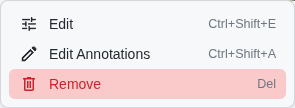

Per quanto riguarda le object property, le azioni disponibili sono le seguenti:

  - [**Edit**](#modifica), mediante il quale è possibile rinominare o effettuare il refactoring dell'entità. Nel caso di refactoring, tutti i nodi dell'entità verranno modificati. È inoltre possibile selezionare se aggiornare o meno l'etichetta;
  - [**Edit Annotations**](#modifica-annotazioni), mediante il quale è possibile aggiungere, modificare o rimuovere le annotazioni delle object property;
  - **Remove**, mediante il quale è possibile eliminare il singolo elemento o tutti i nodi dell'entità. Qualora si scelga di rimuovere tutte le occorrenze, l'entità stessa verrà eliminata.

È inoltre possibile modificare il dominio/range (codominio) della object property spostando gli ancoraggi di origine/destinazione.

## Menu Contestuale Nodo Gerarchia

L'ultimo menu contestuale rilevante è quello disponibile per i nodi gerarchia.

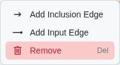

Questo menu consente di:

  - **Add Inclusion Edge**, mediante il quale è possibile disegnare un arco inclusione che collega la gerarchia a una classe genitore;
  - **Add Input Edge**, mediante il quale è possibile disegnare un arco input che collega la gerarchia a una sottoclasse;
  - **Remove**, mediante il quale è possibile rimuovere la gerarchia stessa.

È inoltre possibile modificare la disgiunzione della gerarchia attivando/disattivando il nodo, mentre la completezza può essere modificata attivando/disattivando un arco inclusione.

# Comandi Principali

Nella sezione precedente sono stati illustrati i comandi forniti dai menu contestuali e dalla barra degli strumenti. Alcuni di questi comandi, tuttavia, richiedono una descrizione più dettagliata.

## Aggiungi Nodo Classe

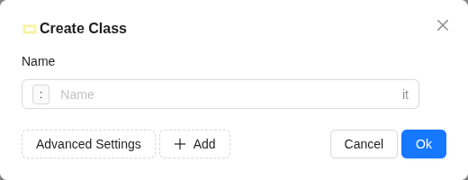

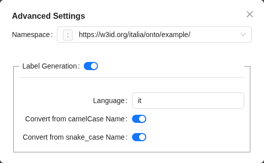

Uno dei primi passi nella costruzione di un'ontologia consiste nell'aggiungere nuove classi. Nell'ambiente del designer, ciò può essere realizzato specificando il nome della classe, dal quale il sistema genererà automaticamente l'IRI.
È possibile aggiungere più classi mediante il clic sul pulsante '+'.

È inoltre possibile accedere alle **Advanced Settings**, mediante le quali è possibile modificare sia lo spazio dei nomi che le impostazioni dell'etichetta. In particolare, è possibile selezionare se recuperare automaticamente l'etichetta dal nome, specificare la lingua dell'etichetta e decidere se deve essere applicata una conversione di maiuscole/minuscole.

## Aggiungi Nodo Data Property

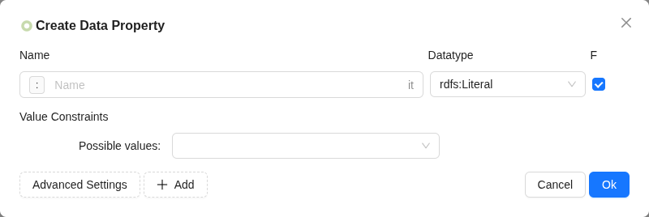

Per aggiungere un nuovo nodo data property, è necessario digitare il nome, selezionare il tipo di dato dall'elenco e specificare se la data property è funzionale. Come per le classi, è possibile aggiungere più data property mediante il clic sul pulsante '+'.

È inoltre possibile accedere alle **Advanced Settings**, mediante le quali è possibile modificare sia lo spazio dei nomi che le impostazioni dell'etichetta.

### Vincoli di Valore
La sezione dei vincoli di valore consente di specificare vincoli e condizioni che il valore della data property deve soddisfare.

I tipi di vincoli disponibili variano a seconda del **tipo di dato** della data property specificata. Ci sono tre categorie principali con diversi tipi di vincoli.

- **Numeri**:
  - **>** | **>=** il valore deve essere maggiore (o uguale) di un certo valore
  - **<** | **<=** il valore deve essere minore (o uguale) di un certo valore
  - **Minore del valore di** il valore deve essere minore del valore di un'altra data property definita sulla stessa classe dominio
  - **Possible Values** un elenco di valori ammessi

- **xsd:string**:
  - **Lunghezza Minima** Specifica una lunghezza minima per il valore stringa
  - **Lunghezza Massima** Specifica una lunghezza massima per il valore stringa
  - **Possible Values** un elenco di valori ammessi

- **Tutti gli altri tipi di dati**:
  - **Possible Values** un elenco di valori ammessi

## Aggiungi Nodo Individuo

Il processo per aggiungere un nuovo nodo individuo è identico a quello per aggiungere una nuova classe. Analogamente, dopo aver digitato il nome dell'individuo, è possibile aggiungerne più di uno mediante il clic sul pulsante '+' o accedere alle **Impostazioni Avanzate**.

## Aggiungi Arco Object Property

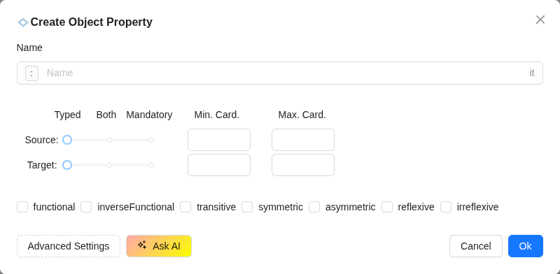

Una volta disegnato un arco object property, è necessario assegnargli un nome e, mediante le **Impostazioni Avanzate**, è inoltre possibile specificare le proprietà, insieme allo spazio dei nomi e alle impostazioni dell'etichetta.

È inoltre possibile specificare vincoli di cardinalità e proprietà per la object property definita.
Sia il dominio che il range possono essere configurati come:
 - **Typed**: il che indica che le istanze nel set di dominio/range sono di un tipo specifico (classe).
 - **Mandatory**: il che indica che qualsiasi istanza della classe specificata come origine/destinazione **deve** partecipare a tale relazione
 - **Both**: entrambe le condizioni precedenti vengono applicate contemporaneamente

## Aggiungi Classe in IS-A

Questo comando consente di [aggiungere un nuovo nodo classe](#aggiungi-nodo-classe) e contemporaneamente specificare se si tratta di una sottoclasse o di una classe genitore di quella corrente.

## Aggiungi Sottogerarchia

Come il comando precedente, anche in questo caso è possibile [aggiungere nuovi nodi classe](#aggiungi-nodo-classe) che formeranno una nuova sottogerarchia della classe corrente. È inoltre possibile specificare la disgiunzione e la completezza di tale sottogerarchia.

## Modifica

Modificando un nodo, è possibile modificare il nome dell'entità e le relative proprietà. È inoltre possibile selezionare se aggiornare o meno l'etichetta.

Esclusivamente per le entità di tipo **classe**, è inoltre possibile selezionare se le modifiche devono interessare ogni occorrenza o soltanto quella selezionata.
Nel caso in cui solo quella selezionata debba essere modificata, verrà creata una nuova **classe**.

## Modifica Annotazioni

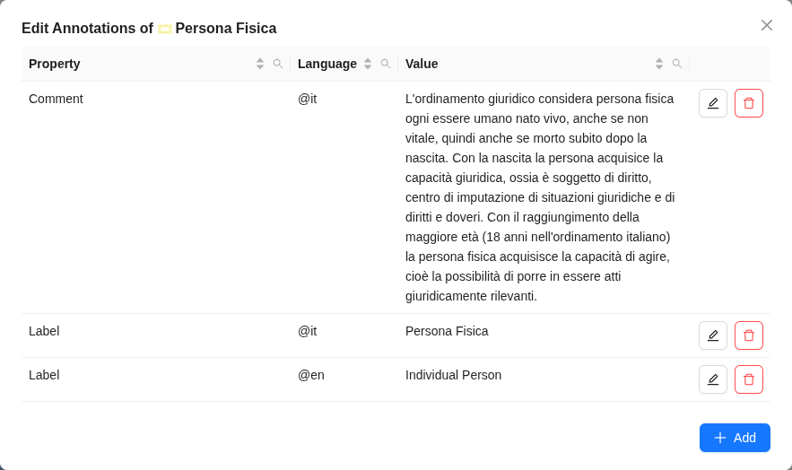

In questa sezione è possibile reperire l'elenco delle annotazioni dell'entità corrente. Ciascuna di queste può essere modificata, eliminata, oppure è possibile aggiungere una nuova annotazione.

# Impostazioni

La finestra modale Impostazioni contiene diverse sezioni per la gestione di vari aspetti dell'ontologia e dell'Ontology Designer.

- [Ontology Manager](#gestore-ontologia)
- [Entity Names](#nomi-entità)
- [Rendering](#rendering)
- [Import Ontology](#importa-ontologia)
- [Entity Catalog](#catalogo-entità): per specificare l'URL dell'SPARQL Endpoint dal quale verranno recuperate le entità da importare facilmente nell'ontologia attuale.
- [Metadata](#metadati)
- [AI Assistant](#impostazioni-assistente-ai)

## Gestore Ontologia

Fino a questo punto sono state illustrate le azioni disponibili che influenzano i singoli elementi dell'ontologia bozza. Nel gestore ontologia è invece possibile esplorare i metadati dell'ontologia.

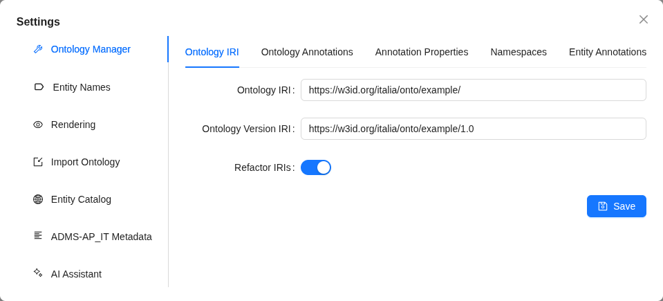

Vi sono disponibili quattro schede:
  - **Ontology IRI**, dove puoi modificare l'IRI dell'ontologia e l'IRI della versione;
  - **Ontology Annotations**, where you can find all the annotations defined in the current ontology for every entity (subject of the annotation). You can also download them as a CSV/Excel file or upload the annotations via the *Import* button from a CSV file.
  - **Annotation Properties**, where you find all the standard annotation properties, such as the label and comment ones. Here as well you can edit, delete or add new properties;
  - **Namespaces**, where you can find all the namespaces defined in the current ontology, along with the associated prefixes. Each of these can be edited, deleted and you can add new ones.
  - **Entity Annotations**, where you can find all the annotations defined in the current ontology for every entity (subject of the annotation). You can also download them as a CSV/Excel file or upload the annotations via the *Import* button from a CSV file.

## Nomi Entità
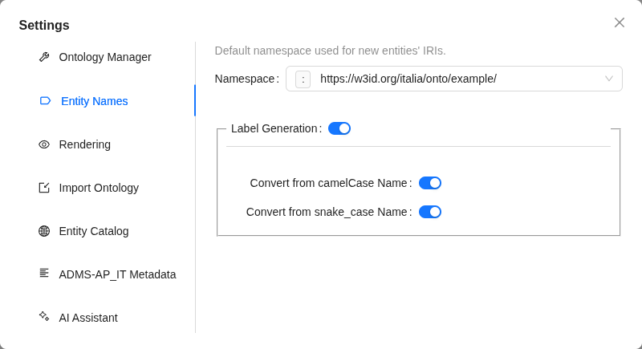

In questa sezione è possibile modificare le impostazioni **globali** per i nomi delle entità che verranno create successivamente.

Nello specifico, è possibile selezionare quale spazio dei nomi verrà utilizzato per generare IRI per le nuove entità.
È inoltre possibile selezionare se generare automaticamente un'etichetta di una nuova entità dal nome, e decidere se deve essere applicata una conversione di maiuscole/minuscole.

> Queste impostazioni saranno disponibili anche durante la creazione di una nuova entità; in tal caso le opzioni selezionate interesseranno esclusivamente l'entità creata e non modificheranno le impostazioni globali.

## Rendering
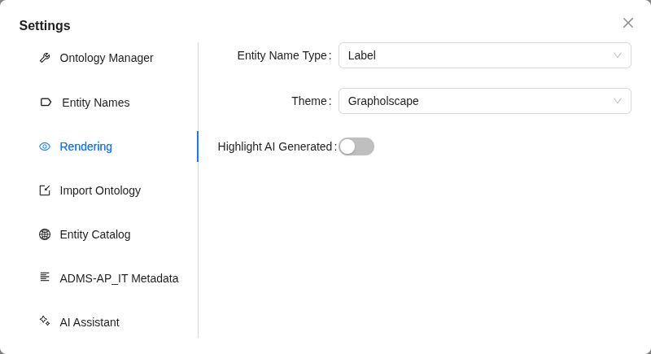

La sezione rendering consente di modificare il nome visualizzato per le entità dell'ontologia, il tema dell'applicazione e se evidenziare o meno le entità generate dall'[Assistente AI Designer](#design-ia)

## Importa Ontologia
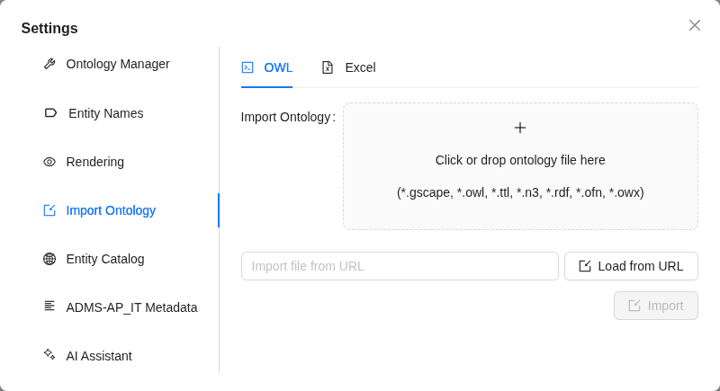

La sezione Importa Ontologia consente di importare altre ontologie da un file o da un URL.

I formati ammessi sono: `.gscape` `.owl` `.ttl` `.n3` `.rdf` `.ofn` `.owx`.

Dove `.gscape` è il formato JSON nativo utilizzato dall'Ontology Designer per l'analisi e la serializzazione delle ontologie.

Nel caso in cui altri formati vengano inviati, verrà eseguita una conversione e una fase di approssimazione rimuoverà gli assiomi al di fuori dell'espressività dell'Ontology Designer.
Ciò è dovuto al fatto che una rappresentazione grafica di un'ontologia deve avere un'espressività limitata al fine di mantenere il grafico leggibile e facilmente navigabile in modo interattivo.

## Metadati
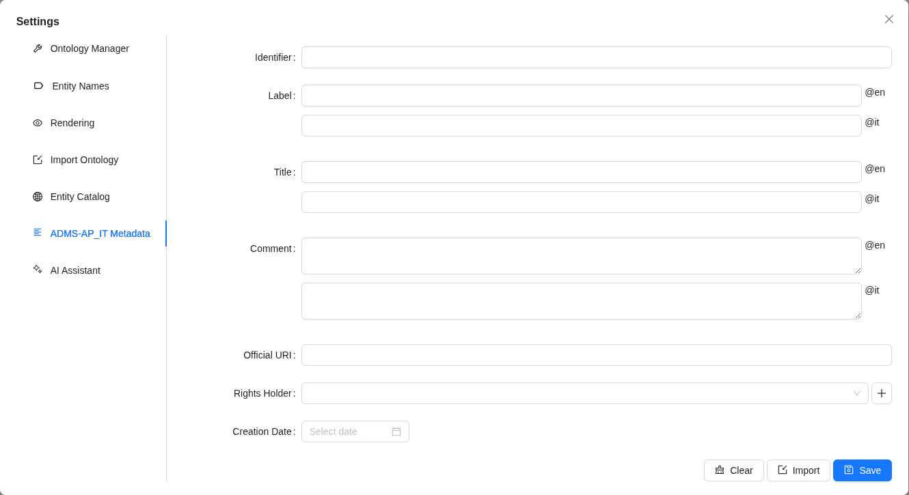

Il presente modulo assiste nell'aggiunta dei metadati necessari all'ontologia al fine di pubblicarla nel sito [NDC](https://schema.gov.it). Tali metadati sono definiti dall'_Asset Description Metadata Schema Ontology - Profilo Applicativo Italiano_ disponibile [qui](https://schema.gov.it/lode/extract?url=https://w3id.org/italia/onto/ADMS).

Si noti che, posizionando il cursore del mouse sull'etichetta dell'elemento del modulo, è possibile visualizzare (e seguire il collegamento a) l'Annotazione OWL che verrà utilizzata per descrivere tale metadato. Alcuni metadati, ad esempio "Rights Holder", sono più complessi di altri poiché questa annotazione richiede un individuo come valore, anziché un semplice letterale. 

Per assistere nella definizione di queste annotazioni, il modulo suggerirà gli individui che sono stati aggiunti al catalogo mediante ontologie precedentemente caricate (annotate come _external_). Tali individui sono considerati come istanze della classe http://xmlns.com/foaf/0.1/Agent. Se l'individuo richiesto non è presente in questo elenco e quindi non è stato utilizzato in alcuna annotazione per le ontologie caricate nel catalogo, è possibile aggiungerlo mediante il clic sul pulsante `+`. Un ulteriore drawer apparirà, consentendo di aggiungere proprietà aggiuntive per l'_Agent_ in corso di definizione. Una volta completato, sarà disponibile per la selezione dall'elenco "Rights Holders". Si noti che, una volta aggiunto un individuo, può essere riutilizzato in diverse ontologie e mediante diverse proprietà di annotazione (ad esempio, gli Agents saranno disponibili anche per "Publisher" e "Creator").

È possibile salvare questi metadati in qualsiasi momento, oppure importarli da un'altra ontologia (pulsante _Import_). In tali casi verranno importate esclusivamente le annotazioni rilevanti (nessun assioma coinvolto).

## Impostazioni Assistente AI
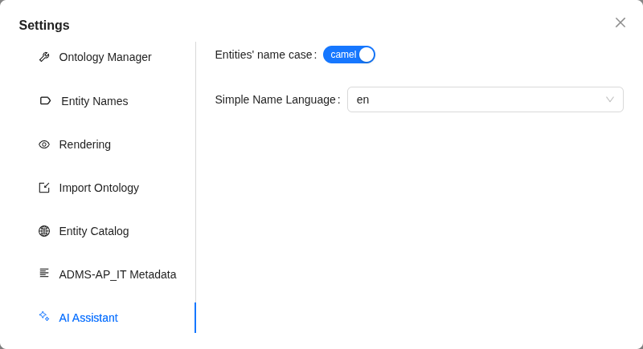

Per modificare il modo in cui l'[Assistente AI Designer](#design-ia) genererà nuovi IRI delle entità.

Nello specifico è possibile selezionare la lingua della parte variabile (il *simple name*) di un IRI di entità generato e se deve utilizzare snake case o camel case.

> La modifica di tali impostazioni tra richieste successive nella medesima sessione potrebbe produrre risultati indesiderati, poiché il sistema si basa su questi *simple names* per associare e riconciliare le entità esistenti con quelle appena generate.

# Catalogo Entità
Il catalogo entità fornisce un metodo per importare facilmente entità da un endpoint SPARQL remoto. L'URL per raggiungere e interrogare l'SPARQL Endpoint può essere impostato nella sezione appropriata delle [Impostazioni](#impostazioni).

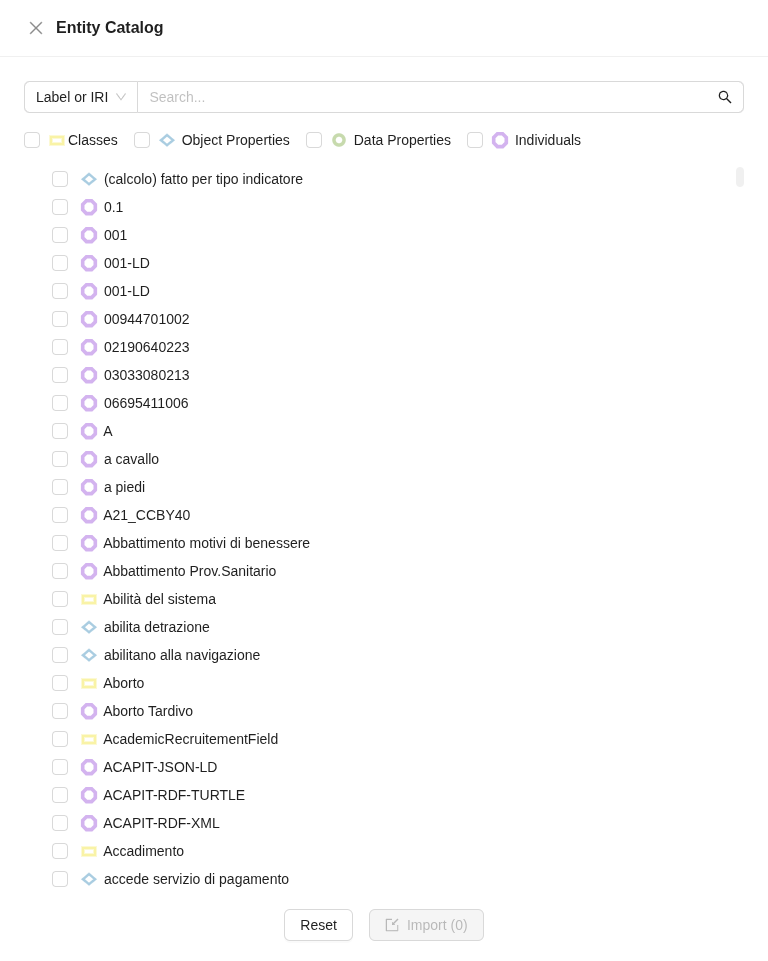

È possibile filtrare per tipo di entità e/o ricercare per **Etichetta** o **IRI**, cercare un testo nei commenti o in base al valore di annotazione **isDefinedBy** definito sulle entità.

È possibile selezionare di importare più entità a condizione che le entità selezionate non includano una object property.

È possibile importare una sola object property per volta, poiché è necessario specificare quali classi verranno utilizzate come dominio e range (ossia i nodi classe di origine e destinazione dell'arco) come illustrato nel modale seguente.

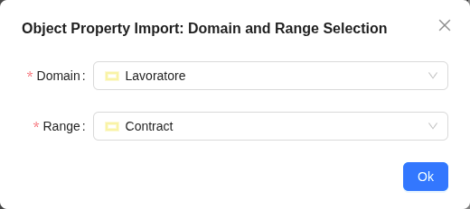

# Assistente AI
L'Ontology Designer è equipaggiato di un Assistente AI per facilitare l'accelerazione del processo di progettazione dell'ontologia o, in alternativa, per fornire spiegazioni e chiarimenti riguardanti l'ontologia corrente.

In tutta l'applicazione, i comandi che attivano processi e flussi di lavoro gestiti dall'Assistente AI sono identificati da un colore sfumato arancione.

Vi sono principalmente tre modalità di utilizzo dell'Assistente AI: [AI Generate nel menu contestuale](#generazione-menu-contestuale), [AI Design](#design-ia), [AI Explain](#spiega).

## Generazione Menu Contestuale

Effettuando un clic destro su un'entità, il comando *AI Generate* consente di generare informazioni in base al tipo di entità:

- **Classe**: è possibile generare un set di data properties, una gerarchia di classi o una descrizione.
- **Data Property**: è possibile generare esclusivamente una descrizione.

La generazione di descrizioni e gerarchie tramite l'Assistente AI è disponibile anche nel modale dedicato a tali comandi.

## Design IA
Effettuando un clic sul pulsante **Design** nella [Barra degli strumenti](#barra-degli-strumenti-principale), è possibile fornire una descrizione in linguaggio naturale del dominio di interesse al fine di ottenere una possibile rappresentazione ontologica di tale dominio.

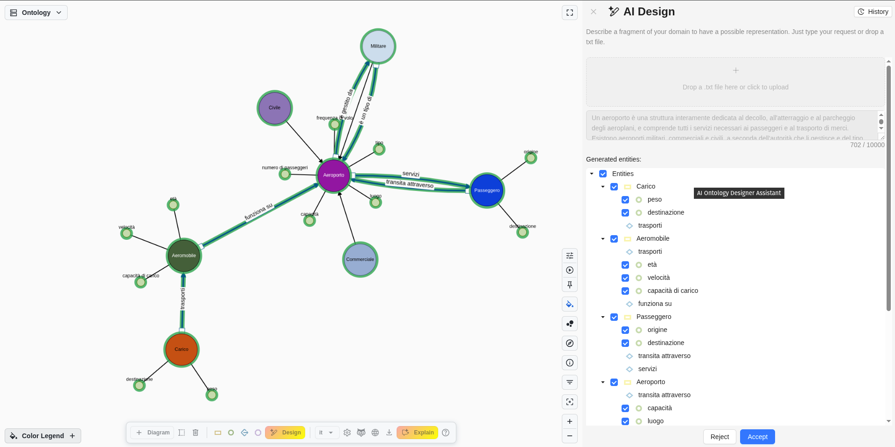

Il risultato verrà visualizzato sia nel grafico dell'ontologia (a sinistra) che come un elenco ad albero delle entità generate (a destra).
Nell'elenco ad albero, le data property e le object property sono raggruppate per le classi generate a cui sono associate.
È possibile selezionare se accettare o rifiutare tutti gli elementi oppure accettare esclusivamente un sottoinsieme di entità.

> Le object property non possono essere selettivamente rifiutate. Ciò è dovuto al fatto che tali entità sono sempre associate a due classi, e il rifiuto potrebbe risultare in uno stato incoerente in cui una object property non presenta alcun nodo di origine/destinazione.

## AI Explain
Effettuando un clic sul pulsante **AI Explain** nella [Barra degli strumenti](#barra-degli-strumenti-principale), è possibile sottoporre domande all'Assistente AI riguardanti l'ontologia corrente.

L'assistente cercherà di utilizzare l'ontologia attuale come contesto al fine di fornire esclusivamente risposte rilevanti. Qualsiasi riferimento alle entità nell'ontologia verrà evidenziato, consentendo una navigazione rapida nel grafico dell'ontologia per ottenere informazioni e dettagli aggiuntivi sull'entità selezionata.

## Cronologia AI
Sia la modalità [AI Design](#design-ia) che [AI Explain](#spiega) dispongono di una propria cronologia dalla quale è possibile visualizzare tutte le richieste emesse. Ogni elemento della cronologia visualizza il testo inviato insieme alla risposta o al risultato fornito dall'assistente.

> La cronologia dell'Assistente AI non viene conservata tra diverse sessioni, il che significa che è possibile visualizzare le richieste precedenti finché la sessione corrente rimane attiva. Ogni volta che viene avviata una nuova sessione, la cronologia verrà reimpostata.
